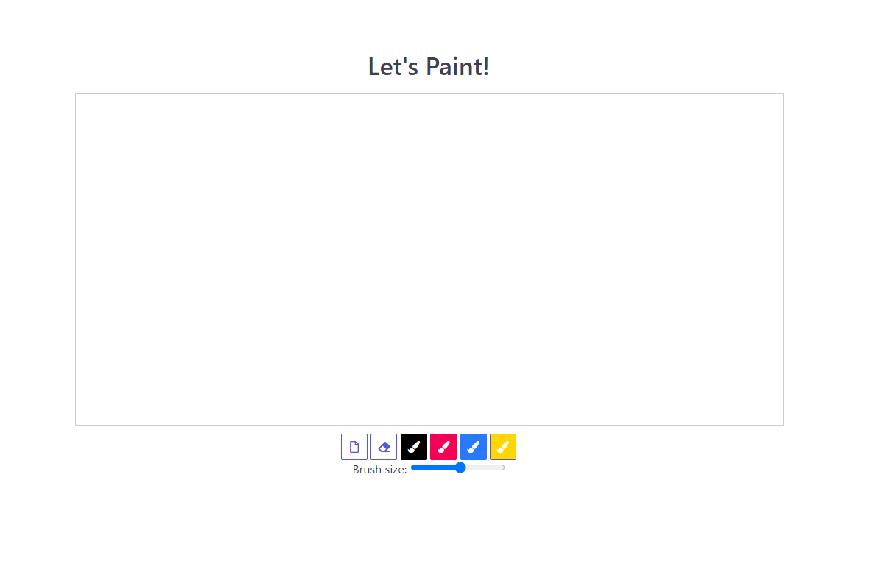

## Assignment 9 and 10

### Question:
Assignment – Let’s paint
Create a page like the video in attached file. You should implement a canvas and four-color brushes (blue, black, red, yellow) to draw on that. You should also implement a slider, an eraser and a clean button. The slider range is between 2 and 15.

For the brush icons you can use font awesome icons with the class “fas fa-paint-brush”, “fas faeraser”, “far fa-file”; and for the buttons and slider layout you can use the spectre CSS framework. 

## Output

